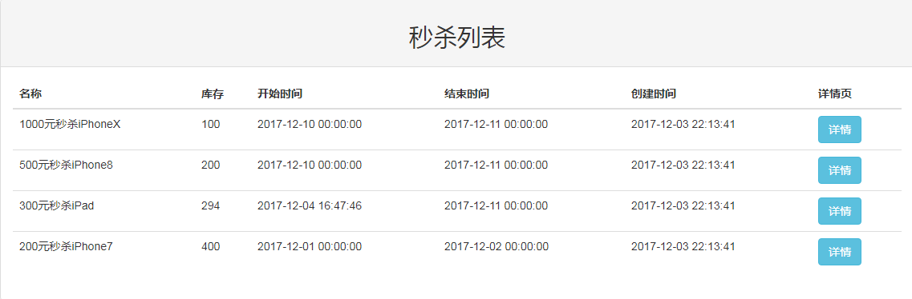

# seckill
一个整合SSM框架的高并发和商品秒杀项目,学习目前较流行的Java框架组合实现高并发秒杀API

## 项目的来源
项目的来源于国内IT公开课平台[慕课网](https://www.imooc.com/u/2145618/courses?sort=publish),慕课网上资源有质量没的说,很适合学习一些技术的基础,这个项目是由四个系列的课程组成的,流程分为几个流程,很基础地教你接触到一个相对有技术含量的项目
 - Java高并发秒杀API之业务分析与DAO层
 - Java高并发秒杀API之web层
 - Java高并发秒杀API之Service层
 - Java高并发秒杀API之高并发优化

其实这几个流程也就是开发的流程,首先从DAO层开始开发,从后往前开发,开始Coding吧！

## 项目环境的搭建
* **操作系统** : Windows 7  
* **IDE** ：MyEclipse 2016 Stable 1.0
* **JDK** : JDK1.8
* **Web容器** ： Tomcat 8.0 
* **数据库** ：Mysql-5.1
* **依赖管理工具** : Maven 3.3

  这里列出的环境不是必须的,你喜欢用什么就用什么,这里只是给出参考,不过不同的版本可能会引起各种不同的问题就需要我们自己去发现以及排查,在这里使用Maven的话时方便我们管理JAR包,我们不用跑去各种开源框架的官网去下载一个又一个的JAR包,配置好了Maven后添加pom文件坐标就会从中央仓库下载JAR包,如果哪天替换版本也很方便
---
## 项目效果图
 - 秒杀商品列表  
 
  

 - 提示输入手机号界面  
 
  


 - 秒杀倒计时提示界面  
 
  

 - 开始秒杀提示界面  
 
 
 
 - 重复秒杀提示界面  
 
  

 - 秒杀成功提示界面  
 
 

 - 秒杀结束提示界面  
 
  

---
## 项目的运行
### 下载  

`Download Zip`或者 `git clone`
``` shell
	git clone https://github.com/iamycx/Spring-learning.git
```
### 导入到IDE  
这里因为是使用`IDEA`创建的项目,所以使用`IDEA`直接打开是很方便的,提前是你要配置好`maven`的相关配置,以及项目`JDK`版本,
`JDK`版本建议在`1.8`以上
  - IDEA  
  直接在主界面选择`Open`,然后找到项目所在路径,点击导入就可以了
  
  
## 项目编码 
项目总结可能比较的长,**密集恐惧症**者请按小节进行阅读  

- [(一)Java高并发秒杀API之业务分析与DAO层](images/note1.md)
- [(二)Java高并发秒杀API之Service层](images/note2.md)
- [(三)Java高并发秒杀API之web层](images/note3.md)
- [(四)Java高并发秒杀API之高并发优化](images/note4.md)  

这里按照上面几个流程走下去,你要有基本的Maven认识以及Java语法的一些概念,要不然可能不太理解
### (一)Java高并发秒杀APi之业务分析与DAO层代码编写
#### 构建项目的基本骨架
 * 首先我们要搭建出一个符合Maven约定的目录来:
 - 使用命令行手动构建一个maven结构的目录,当然我基本不会这样构建
```
mvn archetype:generate -DgroupId=com.iamycx.seckill -DartifactId=seckill -Dversion=1.0.0 -DarchetypeArtifactId=maven-archetype-webapp
```  
这里要注意的是使用`archetype:generate`进行创建,在Maven老版本中是使用`archetype:create`,现在这种方法已经被弃用了,所以使用命令行创建的话注意了,稍微解释下这段语句的意思,就是构建一个一个`maven-archetype-webapp`骨架的Webapp项目,然后`groupId`为`com.suny.seckill `,`artifactId`为`seckill`,这里是Maven相关知识,可以按照自己的情况进行修改    
  
#### 构建pom文件
  
  项目基本的骨架我们就创建出来了,接下来我们要添加一些基本的JAR包的依赖,也就是在`pom.xml`中添加各种开源组件的三坐标了    
  
  ```xml
<project xmlns="http://maven.apache.org/POM/4.0.0" xmlns:xsi="http://www.w3.org/2001/XMLSchema-instance"
  xsi:schemaLocation="http://maven.apache.org/POM/4.0.0 http://maven.apache.org/maven-v4_0_0.xsd">
  <modelVersion>4.0.0</modelVersion>
  <groupId>com.iamycx</groupId>
  <artifactId>seckill</artifactId>
  <packaging>war</packaging>
  <version>1.0.0</version>
  <name>seckill Maven Webapp</name>
  <url>http://maven.apache.org</url>
  <dependencies>
    <dependency>
      <groupId>junit</groupId>
      <artifactId>junit</artifactId>
      <version>4.11</version>
      <scope>test</scope>
    </dependency>
    <!--补全项目依赖-->
    <!--1：日志 java日志：slf4j，log4j，logback，common-logging
        slf4j是规范、接口
        日志实现：log4j，logback，common-logging
        使用：slf4j+logback
    -->
    <dependency>
      <groupId>org.slf4j</groupId>
      <artifactId>slf4j-api</artifactId>
      <version>1.7.12</version>
    </dependency>
    <dependency>
      <groupId>ch.qos.logback</groupId>
      <artifactId>logback-core</artifactId>
      <version>1.1.1</version>
    </dependency>
    <!--实现slf4j接口并整合 -->
    <dependency>
      <groupId>ch.qos.logback</groupId>
      <artifactId>logback-classic</artifactId>
      <version>1.1.1</version>
    </dependency>
    <!--2.数据库相关依赖 -->
    <dependency>
      <groupId>mysql</groupId>
      <artifactId>mysql-connector-java</artifactId>
      <version>5.1.35</version>
      <scope>runtime</scope>
    </dependency>
    <dependency>
      <groupId>c3p0</groupId>
      <artifactId>c3p0</artifactId>
      <version>0.9.1.1</version>
    </dependency>
    <!-- DAO框架 Mybatis依赖 -->
    <dependency>
      <groupId>org.mybatis</groupId>
      <artifactId>mybatis</artifactId>
      <version>3.3.0</version>
    </dependency>
    <!--mybatis自身实现的spring整合依赖 -->
    <dependency>
      <groupId>org.mybatis</groupId>
      <artifactId>mybatis-spring</artifactId>
      <version>1.2.3</version>
    </dependency>
    <!--3. Servlet Web相关依赖 -->
    <dependency>
      <groupId>taglibs</groupId>
      <artifactId>standard</artifactId>
      <version>1.1.2</version>
    </dependency>
    <dependency>
      <groupId>jstl</groupId>
      <artifactId>jstl</artifactId>
      <version>1.2</version>
    </dependency>
    <dependency>
      <groupId>com.fasterxml.jackson.core</groupId>
      <artifactId>jackson-databind</artifactId>
      <version>2.5.4</version>
    </dependency>
    <dependency>
      <groupId>javax.servlet</groupId>
      <artifactId>javax.servlet-api</artifactId>
      <version>3.1.0</version>
    </dependency>
    <!--4. Spring依赖 -->
    <!--1)spring核心依赖 -->
    <dependency>
      <groupId>org.springframework</groupId>
      <artifactId>spring-core</artifactId>
      <version>4.1.7.RELEASE</version>
    </dependency>
    <dependency>
      <groupId>org.springframework</groupId>
      <artifactId>spring-beans</artifactId>
      <version>4.1.7.RELEASE</version>
    </dependency>
    <dependency>
      <groupId>org.springframework</groupId>
      <artifactId>spring-context</artifactId>
      <version>4.1.7.RELEASE</version>
    </dependency>
    <!--2)spring dao层依赖 -->
    <dependency>
      <groupId>org.springframework</groupId>
      <artifactId>spring-jdbc</artifactId>
      <version>4.1.7.RELEASE</version>
    </dependency>
    <dependency>
      <groupId>org.springframework</groupId>
      <artifactId>spring-tx</artifactId>
      <version>4.1.7.RELEASE</version>
    </dependency>
    <!--3)springweb相关依赖 -->
    <dependency>
      <groupId>org.springframework</groupId>
      <artifactId>spring-web</artifactId>
      <version>4.1.7.RELEASE</version>
    </dependency>
    <dependency>
      <groupId>org.springframework</groupId>
      <artifactId>spring-webmvc</artifactId>
      <version>4.1.7.RELEASE</version>
    </dependency>
    <!--4)spring test相关依赖 -->
    <dependency>
      <groupId>org.springframework</groupId>
      <artifactId>spring-test</artifactId>
      <version>4.1.7.RELEASE</version>
    </dependency>

    <!--添加redis依赖 -->
    <dependency>
      <groupId>redis.clients</groupId>
      <artifactId>jedis</artifactId>
      <version>2.7.3</version>
    </dependency>

    <!--prostuff序列化依赖 -->
    <dependency>
      <groupId>com.dyuproject.protostuff</groupId>
      <artifactId>protostuff-core</artifactId>
      <version>1.0.8</version>
    </dependency>
    <dependency>
      <groupId>com.dyuproject.protostuff</groupId>
      <artifactId>protostuff-runtime</artifactId>
      <version>1.0.8</version>
    </dependency>
    <dependency>
      <groupId>commons-collections</groupId>
      <artifactId>commons-collections</artifactId>
      <version>3.2</version>
    </dependency>
    <!--redis客户端 Jedis-->
    <dependency>
      <groupId>redis.clients</groupId>
      <artifactId>jedis</artifactId>
      <version>2.7.3</version>
    </dependency>
    <!--protostuff序列化依赖-->
    <dependency>
      <groupId>com.dyuproject.protostuff</groupId>
      <artifactId>protostuff-core</artifactId>
      <version>1.0.8</version>
    </dependency>
    <dependency>
      <groupId>com.dyuproject.protostuff</groupId>
      <artifactId>protostuff-runtime</artifactId>
      <version>1.0.8</version>
    </dependency>
    <dependency>
      <groupId>commons-collections</groupId>
      <artifactId>commons-collections</artifactId>
      <version>3.2</version>
    </dependency>
  </dependencies>
  <build>
    <finalName>seckill</finalName>
  </build>
</project>

  ```
#### 建立数据库
在根目录下有一个[sql](sql)文件夹里面有一个[sql数据库脚本](sql/seckill.sql),如果你不想自己手写的话就直接导入到你的数据库里面去吧,不过还是建议自己手写一遍加深印象

```sql

--数据库初始化脚本

--创建数据库
CREATE DATABASE seckill;
--使用数据库
use seckill;
--创建秒杀库存表
CREATE TABLE seckill(
`seckill_id` bigint NOT NULL AUTO_INCREMENT COMMENT '商品库存id',
`name` varchar(120) NOT NULL COMMENT '商品名称',
`number` int NOT NULL COMMENT '库存数量',
`start_time` TIMESTAMP NOT NULL COMMENT '秒杀开始时间',
`end_time` TIMESTAMP NOT NULL COMMENT '秒杀结束时间',
`create_time` TIMESTAMP NOT NULL DEFAULT CURRENT_TIMESTAMP COMMENT '创建时间',
PRIMARY KEY (seckill_id),
KEY idx_start_time(start_time),
KEY idx_end_time(end_time),
KEY idx_create_time(create_time)
)ENGINE=InnoDB AUTO_INCREMENT=1000 DEFAULT CHARSET=utf8 COMMENT='秒杀库存表';
--初始化数据
INSERT INTO seckill(name,number,start_time,end_time)
VALUES
  ('1000元秒杀iPhoneX',100,'2017-12-10 00:00:00','2017-12-11 00:00:00'),
  ('500元秒杀iPhone8',200,'2017-12-10 00:00:00','2017-12-11 00:00:00'),
  ('300元秒杀iPad',300,'2017-12-01 00:00:00','2017-12-11 00:00:00'),
  ('200元秒杀iPhone7',400,'2017-12-01 00:00:00','2017-12-02 00:00:00');
--秒杀成功明细表
--用户登录认证相关信息
CREATE TABLE success_killed(
`seckill_id` bigint NOT NULL COMMENT '秒杀商品id',
`user_phone` bigint NOT NULL COMMENT '用户手机号',
`state` tinyint NOT NULL DEFAULT -1 COMMENT '状态标志：-1：无效 0：成功 1：已付款 2：已发货',
`create_time` TIMESTAMP NOT NULL COMMENT '创建时间',
PRIMARY KEY(seckill_id,user_phone),/*联合主键*/
KEY idx_create_time(create_time)
)ENGINE=InnoDB DEFAULT CHARSET=utf8 COMMENT='秒杀成功明细表';
--连接数据库 可以用MySQL Workbench

```
 
---
#### 建立实体类
 - 首先建立`SuccessKilled`  秒杀状态表
```java
package com.iamycx.entity;

import java.util.Date;

/**
 * @Author: iamycx
 * @Date: Created in 11:55 2017/11/29
 */
public class SuccessKilled {
    private long seckillId;
    private long userPhone;
    private short state;
    private Date createTime;
    //变通  多对一
    private Seckill seckill;

    public long getSeckillId() {
        return seckillId;
    }

    public void setSeckillId(long seckillId) {
        this.seckillId = seckillId;
    }

    public long getUserPhone() {
        return userPhone;
    }

    public void setUserPhone(long userPhone) {
        this.userPhone = userPhone;
    }

    public short getState() {
        return state;
    }

    public void setState(short state) {
        this.state = state;
    }

    public Date getCreatTime() {
        return createTime;
    }

    public void setCreatTime(Date createTime) {
        this.createTime = createTime;
    }

    public Seckill getSeckill() {
        return seckill;
    }

    public void setSeckill(Seckill seckill) {
        this.seckill = seckill;
    }

    @Override
    public String toString() {
        return "SuccessKilled{" +
                "seckillId=" + seckillId +
                ", userPhone=" + userPhone +
                ", state=" + state +
                ", createTime=" + createTime +
                '}';
    }
}

```
 - 再建立`Seckill` 秒杀商品信息
```java
package com.iamycx.entity;

import java.util.Date;

/**
 * @Author: iamycx
 * @Date: Created in 11:53 2017/11/29
 */
public class Seckill {
    private long seckillId;
    private String name;
    private int number;
    private Date startTime;
    private Date endTime;
    private Date createTime;

    public long getSeckillId() {
        return seckillId;
    }

    public void setSeckillId(long seckillId) {
        this.seckillId = seckillId;
    }

    public String getName() {
        return name;
    }

    public void setName(String name) {
        this.name = name;
    }

    public int getNumber() {
        return number;
    }

    public void setNumber(int number) {
        this.number = number;
    }

    public Date getStartTime() {
        return startTime;
    }

    public void setStartTime(Date startTime) {
        this.startTime = startTime;
    }

    public Date getEndTime() {
        return endTime;
    }

    public void setEndTime(Date endTime) {
        this.endTime = endTime;
    }

    public Date getCreateTime() {
        return createTime;
    }

    public void setCreateTime(Date createTime) {
        this.createTime = createTime;
    }

    @Override
    public String toString() {
        return "Seckill{" +
                "seckillId=" + seckillId +
                ", name='" + name + '\'' +
                ", number=" + number +
                ", startTime=" + startTime +
                ", endTime=" + endTime +
                ", createTime=" + createTime +
                '}';
    }
}

```
 #### 对实体类创建对应的`mapper`接口,也就是`dao`接口类
 - 首先创建`SeckillDao`,在我这里位于`com.iamycx.dao`包下
 ```java
package com.iamycx.dao;

import com.iamycx.entity.Seckill;
import org.apache.ibatis.annotations.Param;

import java.util.Date;
import java.util.List;
import java.util.Map;

/**
 * @Author: iamycx
 * @Date: Created in 12:02 2017/11/29
 */
public interface SeckillDao {

    //减库存 return如果影响的行数>1，表示更新的记录行数
    int reduceNumber(@Param("seckillId") long seckillId, @Param("killTime") Date killTime);
    //根据id查询秒杀对象
    Seckill queryById(long seckillId);
    //根据偏移量查询秒杀商品列表
    List<Seckill> queryAll(@Param("offset") int offset,@Param("limit") int limit);
    //使用存储过程执行秒杀
    void killByProcedure(Map<String,Object> paramMap);
}

```
 - 再创建`SuccessKilledDao`
 ```java
package com.iamycx.dao;

import com.iamycx.entity.SuccessKilled;
import org.apache.ibatis.annotations.Param;

/**
 * Created by iamycx on 14:12 2017/11/29
 */
public interface SuccessKilledDao {
    //插入购买明细，可以过滤重复 return为插入的行数
    int insertSuccessKilled(@Param("secKillId") long secKillId,@Param("userPhone") long userPhone);
    //根据id查询SucceessKilled并携带秒杀产品对象实体
    SuccessKilled queryByIdWithSeckill(@Param("seckillId") long seckillId,@Param("userPhone") long userPhone);
}

```
#### 接下来书写`xml`配置文件
##### 建立对应的`mapper.xml`  

首先在`src/main/resources`建立`mapper`这个包,这样符合Maven的约定,就是资源放置在`Resource`包下,`Java`包下则是放置`java`类文件,编译后最后还是会在同一个目录下.  
- 首先建立`SeckillDao.xml`
```xml
<?xml version="1.0" encoding="UTF-8" ?>
<!DOCTYPE mapper
        PUBLIC "-//mybatis.org//DTD Mapper 3.0//EN"
        "http://mybatis.org/dtd/mybatis-3-mapper.dtd">

<mapper namespace="com.iamycx.dao.SeckillDao">
    <!--目的：为DAO接口方法提供sql语句配置-->

    <update id="reduceNumber">
        <!--具体的sql语句-->
        UPDATE seckill SET NUMBER = NUMBER - 1
        WHERE seckill_id=#{seckillId}
        AND start_time <![CDATA[ <= ]]> #{killTime}
        AND end_time >= #{killTime}
        AND NUMBER >0;
    </update>

    <select id="queryById" resultType="Seckill" parameterType="long">
        SELECT seckill_id,NAME,NUMBER,start_time,end_time,create_time
        FROM seckill
        WHERE seckill_id = #{seckillId}
    </select>

    <select id="queryAll" resultType="Seckill">
        SELECT seckill_id,NAME,NUMBER,start_time,end_time,create_time
        FROM seckill
        ORDER BY create_time DESC
        limit #{offset},#{limit}
    </select>
    <!--mybatis调用 存储过程 -->
    <select id="killByProcedure" statementType="CALLABLE">
        call execute_seckill(
        #{seckillId,jdbcType=BIGINT,mode=IN},
        #{phone,jdbcType=BIGINT,mode=IN},
        #{killTime,jdbcType=TIMESTAMP,mode=IN},
        #{result,jdbcType=INTEGER,mode=OUT}
        )
    </select>
</mapper>
```
- 建立`SuccessKilledDao.xml`
```xml
<?xml version="1.0" encoding="UTF-8" ?>
<!DOCTYPE mapper
        PUBLIC "-//mybatis.org//DTD Mapper 3.0//EN"
        "http://mybatis.org/dtd/mybatis-3-mapper.dtd">

<mapper namespace="com.iamycx.dao.SuccessKilledDao">
    <update id="insertSuccessKilled">
        <!--主键冲突的时候，忽视报错-->
        INSERT ignore INTO success_killed(seckill_id,user_phone,state)
        VALUES (#{secKillId},#{userPhone},0)
    </update>

    <select id="queryByIdWithSeckill" resultType="SuccessKilled">
        <!--根据id查询SucceessKilled并携带秒杀产品对象Seckill实体-->
        <!--如果告知MyBatis把结果映射到SuccessKilled同时映射seckill属性-->
        <!--可以自由控制SQL-->
        SELECT
          sk.seckill_id,
          sk.user_phone,
          sk.create_time,
          sk.state,
          s.seckill_id "seckill.seckill_id",
          s.name "seckill.name",
          s.number "seckill.number",
          s.start_time "seckill.start_time",
          s.end_time "seckill.end_time",
          s.create_time "seckill.create_time"
        FROM success_killed sk
        INNER JOIN seckill s ON sk.seckill_id=s.seckill_id
        WHERE sk.seckill_id = #{seckillId} AND sk.user_phone=#{userPhone}
    </select>
</mapper>
```
- 建立`Mybatis`的配置文件`mybatis-config.xml`
```xml
<?xml version="1.0" encoding="UTF-8" ?>
<!DOCTYPE configuration
        PUBLIC "-//mybatis.org//DTD Config 3.0//EN"
        "http://mybatis.org/dtd/mybatis-3-config.dtd">
<configuration>
    <!--配置全局属性-->
    <settings>
        <!--使用JDBC的getGeneratedKeys获取数据库自增主键值-->
        <setting name="useGeneratedKeys" value="true"/>
        <!--使用列别名替换列名 默认：true     select name as title from table-->
        <setting name="useColumnLabel" value="true"/>
        <!--开启驼峰命名转换：Table(create_time)->Entity(createTime)-->
        <setting name="mapUnderscoreToCamelCase" value="true"/>
    </settings>
</configuration>
```
- 然后建立连接数据库的配置文件`jdbc.properties`,这里的属性要根据自己的需要去进行修改,切勿直接复制使用  
```properties
driver=com.mysql.jdbc.Driver
url=jdbc:mysql://localhost:3306/seckill?useUnicode=true&characterEncoding=utf8
user=root
password=root
```
- 建立`Spring`的`dao`的配置文件,在`resources/spring`包下创建`spring-dao.xml`
```xml
<?xml version="1.0" encoding="UTF-8"?>
<beans xmlns="http://www.springframework.org/schema/beans"
       xmlns:xsi="http://www.w3.org/2001/XMLSchema-instance"
       xmlns:context="http://www.springframework.org/schema/context"
       xsi:schemaLocation="http://www.springframework.org/schema/beans
 http://www.springframework.org/schema/beans/spring-beans.xsd http://www.springframework.org/schema/context http://www.springframework.org/schema/context/spring-context.xsd">
    <!--配置整合MyBatis过程-->

    <!--1：配置数据库相关参数 properties的属性：${url}-->
    <context:property-placeholder location="classpath:jdbc.properties"/>

    <!--2：数据库连接池-->
    <bean id="dataSource" class="com.mchange.v2.c3p0.ComboPooledDataSource">
        <!--配置连接池属性-->
        <property name="driverClass" value="${driver}"/>
        <property name="jdbcUrl" value="${url}"/>
        <property name="user" value="${user}"/>
        <property name="password" value="${password}"/>

        <!--c3p0连接池的私有属性配置-->
        <property name="maxPoolSize" value="30"/>
        <property name="minPoolSize" value="10"/>
        <!--关闭连接后不自动commit-->
        <property name="autoCommitOnClose" value="false"/>
        <!--获取连接超时时间-->
        <property name="checkoutTimeout" value="1000"/>
        <!--当获取连接失败重试次数-->
        <property name="acquireRetryAttempts" value="2"/>
    </bean>

    <!--3：配置SqlSessionFactory对象-->
    <bean id="sqlSessionFactory" class="org.mybatis.spring.SqlSessionFactoryBean">
        <!--注入数据库连接池-->
        <property name="dataSource" ref="dataSource"/>
        <!--配置MyBatis全局配置文件：mybatis-config.xml-->
        <property name="configLocation" value="classpath:mybatis-config.xml"/>
        <!--扫描entity包，使用别名-->
        <property name="typeAliasesPackage" value="com.iamycx.entity"/>
        <!--扫描sql配置文件：mapper需要的xml文件-->
        <property name="mapperLocations" value="classpath:mapper/*.xml"/>
    </bean>

    <!--4：配置扫描Dao接口包，动态实现Dao接口，注入到Spring容器中-->
    <bean class="org.mybatis.spring.mapper.MapperScannerConfigurer">
        <!--注入sqlSessionFactory-->
        <property name="sqlSessionFactoryBeanName" value="sqlSessionFactory"/>
        <!--给出需要扫描Dao接口包-->
        <property name="basePackage" value="com.iamycx.dao"/>
    </bean>

    <!--注入RedisDao-->
    <bean id="redisDao" class="com.iamycx.dao.cache.RedisDao">
        <constructor-arg index="0" value="localhost"/>
        <constructor-arg index="1" value="6379"/>
    </bean>
</beans>
```

- 基础的部分我们搭建完成了,然后要开始测试了
 在`IDEA`里面有一个快速建立测试的快捷键`Ctrl+Shift+T`,在某个要测试的类里面按下这个快捷键就会出现`Create new Test`,然后选择你要测试的方法跟测试的工具就可以了,这里我们使用Junit作为测试
  + 建立`SeckillDaoTest`文件,代码如下
 ```java
package com.iamycx.dao;

import com.iamycx.entity.Seckill;
import org.junit.Test;
import org.junit.runner.RunWith;
import org.springframework.test.context.ContextConfiguration;
import org.springframework.test.context.junit4.SpringJUnit4ClassRunner;

import javax.annotation.Resource;

import java.util.Date;
import java.util.List;

/**
 * Created by iamycx on 16:08 2017/11/29
 */
/**
 * 配置spring和junit整合，junit启动时加载springIOC容器
 * spring-test,junit
 */
@RunWith(SpringJUnit4ClassRunner.class)
//告知junit spring配置文件
@ContextConfiguration({"classpath:spring/spring-dao.xml"})
public class SeckillDaoTest {

    //注入Dao实现类依赖
    @Resource
    private SeckillDao seckillDao;

    @Test
    public void queryById() throws Exception {
        long id = 1000;
        Seckill seckill = seckillDao.queryById(id);
        System.out.println(seckill.getName());
        System.out.println(seckill);
        /**
         * 1000元秒杀iPhoneX
         Seckill{seckillId=1000, name='1000元秒杀iPhoneX', number=100, startTime=Sun Dec 10 00:00:00 CST 2017, endTime=Mon Dec 11 00:00:00 CST 2017, createTime=Wed Nov 29 11:48:42 CST 2017}
         */
    }

    @Test
    public void queryAll() throws Exception {
        /**
         * Caused by: org.apache.ibatis.binding.BindingException: Parameter 'offet' not found. Available parameters are [0, 1, param1, param2]
         *
         * List<Seckill> queryAll(int offet,int limit);
         * java没有保存形参的记录  queryAll(int offet,int limit)—>queryAll(arg0,arg1)
         * 改为List<Seckill> queryAll(@Param("offset") int offset,@Param("limit") int limit);
         */
        List<Seckill> seckills = seckillDao.queryAll(0,100);
        for (Seckill s:seckills){
            System.out.println(s);
        }
        /**
         * Seckill{seckillId=1000, name='1000元秒杀iPhoneX', number=100, startTime=Sun Dec 10 00:00:00 CST 2017, endTime=Mon Dec 11 00:00:00 CST 2017, createTime=Wed Nov 29 11:48:42 CST 2017}
         Seckill{seckillId=1001, name='500元秒杀iPhone8', number=200, startTime=Sun Dec 10 00:00:00 CST 2017, endTime=Mon Dec 11 00:00:00 CST 2017, createTime=Wed Nov 29 11:48:42 CST 2017}
         Seckill{seckillId=1002, name='300元秒杀iPad', number=300, startTime=Sun Dec 10 00:00:00 CST 2017, endTime=Mon Dec 11 00:00:00 CST 2017, createTime=Wed Nov 29 11:48:42 CST 2017}
         Seckill{seckillId=1003, name='1000元秒杀iPhone7', number=400, startTime=Sun Dec 10 00:00:00 CST 2017, endTime=Mon Dec 11 00:00:00 CST 2017, createTime=Wed Nov 29 11:48:42 CST 2017}
         */
    }

    @Test
    public void reduceNumber() throws Exception {
        Date killTime = new Date();
        int updateCount = seckillDao.reduceNumber(1000L,killTime);
        System.out.println("updateCount="+updateCount);
    }

}
```
测试中可能会出现`Mybatis`参数绑定失败的错误,在`mapper`接口中的方法里面添加`@Param`的注解,显示的告诉mybatis参数的名称是什么,例如
```java
 List<Seckill> queryAll(@Param("offset") int offset, @Param("limit") int limit);
```  

---   

### (二)Java高并发秒杀API之Service层 
 首先在编写`Service`层代码前,我们应该首先要知道这一层到底时干什么的,这里摘取来自`ITEYE`一位博主的原话
 > Service层主要负责业务模块的逻辑应用设计。同样是首先设计接口,再设计其实现的类,接着再Spring的配置文件中配置其实现的关联。这样我们就可以在应用中调用Service接口来进行业务处理。Service层的业务实现,具体要调用到已定义的DAO层的接口,封装Service层的业务逻辑有利于通用的业务逻辑的独立性和重复利用性,程序显得非常简洁。  
 
 在项目中要降低耦合的话,分层是一种很好的概念,就是各层各司其职,尽量不做不相干的事,所以`Service`层的话顾名思义就是**业务逻辑**,处理程序中的一些业务逻辑,以及调用`DAO`层的代码,这里我们的`DAo`层就是连接数据库的那一层,调用关系可以这样表达:  
   View(页面)>Controller(控制层)>Service(业务逻辑)>Dao(数据访问)>Database(数据库)  
   + 首先还是接口的设计,设计Service秒杀商品的接口  ``SeckillService``
  首先在`som.iamycx`包下建立`service`这个包,这个包里面存放`Service`相关的接口,然后建立`SeckillService`接口文件,代码如下:
  ```java
package com.iamycx.service;

import com.iamycx.dto.Exposer;
import com.iamycx.dto.SeckillExecution;
import com.iamycx.entity.Seckill;
import com.iamycx.exception.RepeatKillException;
import com.iamycx.exception.SeckillCloseException;
import com.iamycx.exception.SeckillException;

import java.util.List;

/**
 * Created by iamycx on 21:10 2017/11/29
 *
 * 业务接口：站在“使用者”角度设计接口
 * 三个方面：方法定义的粒度，参数，返回类型（return类型/异常）
 */
public interface SeckillService {
    //查询所有秒杀记录
    List<Seckill> getSeckillList();
    //查询单个秒杀记录
    Seckill getById(long seckillId);
    //秒杀开始时候输出秒杀接口地址，否者输出秒杀开始时间和系统时间
    Exposer exportSeckillUrl(long seckillId);
    //执行秒杀操作
    SeckillExecution executeSeckill(long seckillId, long userPhone, String md5) throws SeckillException,RepeatKillException,SeckillCloseException;
    //执行秒杀操作by存储过程
    SeckillExecution executeSeckillProcedure(long seckillId, long userPhone, String md5);
}

```
建立后接口之后我们要写实现类了,在写实现类的时候我们肯定会碰到一个这样的问题,你要向前端返回`json`数据的话,你是返回什么样的数据好?直接返回一个数字状态码或者时文字?这样设计肯定是不好的,所以我们应该向前段返回一个实体信息`json`,里面包含了一系列的信息,无论是哪种状态都应该可以应对,既然是与数据库字段无关的类,那就不是`PO`了,所以我们建立一个`DTO`数据传输类,关于常见的几种对象我的解释如下:
 + PO:   也就是我们在为每一张数据库表写一个实体的类
 + VO,   对某个页面或者展现层所需要的数据,封装成一个实体类
 + BO,   就是业务对象,我也不是很了解
 + DTO,  跟VO的概念有点混淆,也是相当于页面需要的数据封装成一个实体类
 + POJO, 简单的无规则java对象
 
 在`com.iamycx`下建立`dto`包,然后建立`Exposer`类,这个类是秒杀时数据库那边处理的结果的对象
  ```java
package com.iamycx.dto;

/**
 * Created by iamycx on 21:17 2017/11/29
 *
 * 暴露秒杀地址DTO
 */
public class Exposer {
    //是否开启秒杀
    private boolean exposed;
    //一种加密措施
    private String md5;
    //id
    private long seckillId;
    //系统当前时间(毫秒)
    private long now;
    //开始时间
    private long start;
    //结束时间
    private long end;

    public Exposer(boolean exposed, String md5, long seckillId) {
        this.exposed = exposed;
        this.md5 = md5;
        this.seckillId = seckillId;
    }

    public Exposer(boolean exposed, long seckillId, long now, long start, long end) {
        this.exposed = exposed;
        this.seckillId = seckillId;
        this.now = now;
        this.start = start;
        this.end = end;
    }

    public Exposer(boolean exposed, long seckillId) {
        this.exposed = exposed;
        this.seckillId = seckillId;
    }

    public boolean isExposed() {
        return exposed;
    }

    public void setExposed(boolean exposed) {
        this.exposed = exposed;
    }

    public String getMd5() {
        return md5;
    }

    public void setMd5(String md5) {
        this.md5 = md5;
    }

    public long getSeckillId() {
        return seckillId;
    }

    public void setSeckillId(long seckillId) {
        this.seckillId = seckillId;
    }

    public long getNow() {
        return now;
    }

    public void setNow(long now) {
        this.now = now;
    }

    public long getStart() {
        return start;
    }

    public void setStart(long start) {
        this.start = start;
    }

    public long getEnd() {
        return end;
    }

    public void setEnd(long end) {
        this.end = end;
    }

    @Override
    public String toString() {
        return "Exposer{" +
                "exposed=" + exposed +
                ", md5='" + md5 + '\'' +
                ", seckillId=" + seckillId +
                ", now=" + now +
                ", start=" + start +
                ", end=" + end +
                '}';
    }
}
```
然后我们给页面返回的数据应该是更加友好的封装数据,所以我们再在`com.iamycx.dto`包下再建立`SeckillExecution`用来封装给页面的结果:

```java
package com.iamycx.dto;

import com.iamycx.entity.SuccessKilled;
import com.iamycx.enums.SeckillStatEnum;

/**
 * Created by iamycx on 21:27 2017/11/29
 *
 * 封装秒杀执行后的结果
 */
public class SeckillExecution {
    private long seckillId;
    //秒杀执行结果的状态
    private int state;
    //状态表示
    private String stateInfo;
    //秒杀成功对象
    private SuccessKilled successKilled;

    public SeckillExecution(long seckillId, SeckillStatEnum statEnum, SuccessKilled successKilled) {
        this.seckillId = seckillId;
        this.state = statEnum.getState();
        this.stateInfo = statEnum.getStateInfo();
        this.successKilled = successKilled;
    }

    public SeckillExecution(long seckillId, SeckillStatEnum statEnum) {
        this.seckillId = seckillId;
        this.state = statEnum.getState();
        this.stateInfo = statEnum.getStateInfo();
    }

    public long getSeckillId() {
        return seckillId;
    }

    public void setSeckillId(long seckillId) {
        this.seckillId = seckillId;
    }

    public int getState() {
        return state;
    }

    public void setState(int state) {
        this.state = state;
    }

    public String getStateInfo() {
        return stateInfo;
    }

    public void setStateInfo(String stateInfo) {
        this.stateInfo = stateInfo;
    }

    public SuccessKilled getSuccessKilled() {
        return successKilled;
    }

    public void setSuccessKilled(SuccessKilled successKilled) {
        this.successKilled = successKilled;
    }

    @Override
    public String toString() {
        return "SeckillExecution{" +
                "seckillId=" + seckillId +
                ", state=" + state +
                ", stateInfo='" + stateInfo + '\'' +
                ", successKilled=" + successKilled +
                '}';
    }
}

```
##### 定义秒杀中可能会出现的异常
  + 定义一个基础的异常,所有的子异常继承这个异常`SeckillException`
  ````java
package com.iamycx.exception;

/**
 * Created by iamycx on 21:36 2017/11/29
 */
public class SeckillException extends RuntimeException {

    public SeckillException(String message) {
        super(message);
    }

    public SeckillException(String message, Throwable cause) {
        super(message, cause);
    }
}

````
    + 首选可能会出现秒杀关闭后被秒杀情况,所以建立秒杀关闭异常`SeckillCloseException`,需要继承我们一开始写的基础异常 
```java
package com.iamycx.exception;

/**
 * Created by iamycx on 21:34 2017/11/29
 *
 * 秒杀关闭异常
 */
public class SeckillCloseException extends SeckillException{

    public SeckillCloseException(String message) {
        super(message);
    }

    public SeckillCloseException(String message, Throwable cause) {
        super(message, cause);
    }
}

```
   + 然后还有可能发生重复秒杀异常`RepeatKillException`
   ```java
package com.iamycx.exception;

/**
 * Created by iamycx on 21:31 2017/11/29
 *
 * 重复秒杀异常（运行期异常）
 */
public class RepeatKillException extends SeckillException{

    public RepeatKillException(String message) {
        super(message);
    }

    public RepeatKillException(String message, Throwable cause) {
        super(message, cause);
    }
}

```
#### 实现`Service`接口
```java
package com.iamycx.service.impl;

import com.iamycx.dao.SeckillDao;
import com.iamycx.dao.SuccessKilledDao;
import com.iamycx.dao.cache.RedisDao;
import com.iamycx.dto.Exposer;
import com.iamycx.dto.SeckillExecution;
import com.iamycx.entity.Seckill;
import com.iamycx.entity.SuccessKilled;
import com.iamycx.enums.SeckillStatEnum;
import com.iamycx.exception.RepeatKillException;
import com.iamycx.exception.SeckillCloseException;
import com.iamycx.exception.SeckillException;
import com.iamycx.service.SeckillService;
import org.apache.commons.collections.MapUtils;
import org.slf4j.Logger;
import org.slf4j.LoggerFactory;
import org.springframework.beans.factory.annotation.Autowired;
import org.springframework.stereotype.Service;
import org.springframework.transaction.annotation.Transactional;
import org.springframework.util.DigestUtils;

import java.util.Date;
import java.util.HashMap;
import java.util.List;
import java.util.Map;

/**
 * Created by iamycx on 21:40 2017/11/29
 */
@Service
public class SeckillServiceImpl implements SeckillService{

    private Logger logger = LoggerFactory.getLogger(this.getClass());
    //注入service依赖
    @Autowired
    private SeckillDao seckillDao;
    @Autowired
    private SuccessKilledDao successKilledDao;
    @Autowired
    private RedisDao redisDao;
    //md5盐值字符串，用于混淆md5
    private final String slat = "fidie@#$((!!feoo3fi2335-i***43r9*/-++";

    public List<Seckill> getSeckillList() {
        return seckillDao.queryAll(0,4);
    }

    public Seckill getById(long seckillId) {
        return seckillDao.queryById(seckillId);
    }

    public Exposer exportSeckillUrl(long seckillId) {
        //优化缓存
        //1.访问redis
        Seckill seckill = redisDao.getSeckill(seckillId);
        if(seckill==null){
            //2.访问数据库
            seckill = seckillDao.queryById(seckillId);
            if (seckill==null){
                return new Exposer(false,seckillId);
            }else {
                //3.放入redis
                redisDao.putSeckill(seckill);
            }
        }

        if(seckill==null){
            return new Exposer(false,seckillId);
        }
        Date startTime = seckill.getStartTime();
        Date endTime = seckill.getEndTime();
        //系统的当前时间
        Date nowTime = new Date();
        if(nowTime.getTime()<startTime.getTime()||nowTime.getTime()>endTime.getTime()){
            return new Exposer(false,seckillId,nowTime.getTime(),startTime.getTime(),endTime.getTime());
        }
        //转化特定字符串的过程，不可逆的
        String md5 = getMD5(seckillId);
        return new Exposer(true,md5,seckillId);
    }

    private String getMD5(long seckillId){
        String base = seckillId+"/"+slat;
        String md5 = DigestUtils.md5DigestAsHex(base.getBytes());
        return md5;
    }

    @Transactional
    /**
     * 使用注解控制方法的优点：
     * 1.开发团队约定明确标注事务方法的风格；
     * 2.保证事务方法的执行时间尽可能短，不要穿插其他的网络操作:RPC/HTTP请求、或移动到事务方法外部；
     * 3.不是所有的方法都需要事务，如果只有一条修改操作，只读操作不需要事务控制。
     */
    public SeckillExecution executeSeckill(long seckillId, long userPhone, String md5) throws SeckillException, RepeatKillException, SeckillCloseException {
        if(md5 == null || !md5.equals(getMD5(seckillId))){
            throw new SeckillException("seckill data rewrite");
        }
        Date nowTime = new Date();

        try {
            //记录购买行为
            int insertCount = successKilledDao.insertSuccessKilled(seckillId,userPhone);
            //唯一seckillId,userPhone
            if(insertCount<=0){
                //重复秒杀
                throw new RepeatKillException("seckill repeated");
            } else {
                //减库存,热点商品竞争
                int updateCount = seckillDao.reduceNumber(seckillId,nowTime);
                if(updateCount<=0){
                    //没有更新到记录，秒杀结束 rollback
                    throw new SeckillCloseException("seckill is closed");
                } else {
                    //秒杀成功 commit
                    SuccessKilled successKilled = successKilledDao.queryByIdWithSeckill(seckillId,userPhone);
                    return new SeckillExecution(seckillId, SeckillStatEnum.SUCCESS,successKilled);
                }
            }

        } catch (SeckillCloseException e1){
            throw e1;
        } catch (RepeatKillException e2){
            throw e2;
        } catch (Exception e) {
            logger.error(e.getMessage(),e);
            //所有编译器异常转化为运行期异常
            throw new SeckillException("Seckill inner error"+e.getMessage());
        }
    }

    //使用存储过程的秒杀逻辑
    public SeckillExecution executeSeckillProcedure(long seckillId, long userPhone, String md5) {
        if(md5==null||!md5.equals(getMD5(seckillId))){
            return new SeckillExecution(seckillId,SeckillStatEnum.DATA_REWRITE);
        }
        Date killTime = new Date();
        Map<String,Object> map = new HashMap<String,Object>();
        map.put("seckillId",seckillId);
        map.put("phone",userPhone);
        map.put("killTime",killTime);
        map.put("result",null);
        try {
            seckillDao.killByProcedure(map);
            //获取result
            int result = MapUtils.getInteger(map,"result",-2);
            if (result==1){
                SuccessKilled successKilled = successKilledDao.queryByIdWithSeckill(seckillId,userPhone);
                return new SeckillExecution(seckillId,SeckillStatEnum.SUCCESS,successKilled);
            } else {
                return new SeckillExecution(seckillId,SeckillStatEnum.stateOf(result));
            }
        } catch (Exception e) {
            logger.error(e.getMessage(),e);
            return new SeckillExecution(seckillId,SeckillStatEnum.INNER_ERROR);
        }
    }
}

```
在这里我们捕获了运行时异常,这样做的原因就是`Spring`的事物默认就是发生了`RuntimeException`才会回滚,可以检测出来的异常是不会导致事物的回滚的,这样的目的就是你明知道这里会发生异常,所以你一定要进行处理.如果只是为了让编译通过的话,那捕获异常也没多意思,所以这里要注意事物的回滚.  
然后我们还发现这里存在硬编码的现象,就是返回各种字符常量,例如`秒杀成功`,`秒杀失败`等等,这些字符串时可以被重复使用的,而且这样维护起来也不方便,要到处去类里面寻找这样的字符串,所有我们使用枚举类来管理这样状态,在`con.iamycx`包下建立`enums`包,专门放置枚举类,然后再建立`SeckillStatEnum`枚举类:
```java
package com.iamycx.enums;

/**
 * Created by iamycx on 22:22 2017/11/29
 *
 * 使用枚举表示常量数据字段
 */
public enum SeckillStatEnum {
    SUCCESS(1,"秒杀成功"),
    END(0,"秒杀结束"),
    REPEAT_KILL(-1,"重复秒杀"),
    INNER_ERROR(-2,"系统异常"),
    DATA_REWRITE(-3,"数据篡改");

    private int state;
    private String stateInfo;

    SeckillStatEnum(int state, String stateInfo) {
        this.state = state;
        this.stateInfo = stateInfo;
    }

    public int getState() {
        return state;
    }

    public String getStateInfo() {
        return stateInfo;
    }

    public static SeckillStatEnum stateOf(int index){
        for(SeckillStatEnum state:values()){
            if (state.getState() == index){
                return state;
            }
        }
        return null;
    }
}

```
既然把这些改成了枚举,那么在`SeckillServiceImpl`类中的`executeSeckill`方法中成功秒杀的返回值就应该修改为  
```java
return new SeckillExecution(seckillId, SeckillStatEnum.SUCCESS, successKilled);
```

####  下一步肯定要注入Service了
首先在`resources/spring`下建立`spring-service.xml`文件,用来配置`Service层的相关代码`:

```xml
<?xml version="1.0" encoding="UTF-8"?>
<beans xmlns="http://www.springframework.org/schema/beans"
       xmlns:xsi="http://www.w3.org/2001/XMLSchema-instance"
       xmlns:context="http://www.springframework.org/schema/context"
       xmlns:tx="http://www.springframework.org/schema/tx"
       xsi:schemaLocation="http://www.springframework.org/schema/beans
       http://www.springframework.org/schema/beans/spring-beans.xsd
       http://www.springframework.org/schema/context
       http://www.springframework.org/schema/context/spring-context.xsd
       http://www.springframework.org/schema/tx
       http://www.springframework.org/schema/tx/spring-tx.xsd">
    <!--扫描service包下所有使用注解的类型-->
    <context:component-scan base-package="com.iamycx.service"/>

    <!--配置事务管理器-->
    <bean id="transactionManager" class="org.springframework.jdbc.datasource.DataSourceTransactionManager">
        <!--注入数据库的连接池-->
        <property name="dataSource" ref="dataSource"/>
    </bean>

    <!--配置基于注解的声明式事物  默认使用注解来管理事物行为-->
    <tx:annotation-driven transaction-manager="transactionManager"/>
</beans>
```
在这里开启了基于**注解**的事物,常见的事物操作有以下几种方法
 + 在Spring早期版本中是使用ProxyFactoryBean+XMl方式来配置事物.
 + 在Spring配置文件使用tx:advice+aop命名空间,好处就是一次配置永久生效,你无须去关心中间出的问题,不过出错了你很难找出来在哪里出了问题
 + 注解@Transactional的方式,注解可以在`方法定义`,`接口定义`,`类定义`,`public方法上`,但是不能注解在`private`,`final`,`static`等方法上,因为Spring的事物管理默认是使用Cglib动态代理的:
   - private方法因为访问权限限制,无法被子类覆盖
   - final方法无法被子类覆盖
   - static时类级别的方法,无法被子类覆盖
   - protected方法可以被子类覆盖,因此可以被动态字节码增强
##### 不能被Spring AOP事物增强的方法  
  | 序号 | 动态代理策略 |不能被事物增强的方法 |
  |:-----:| :-----: |:-----:|
  |   1   |基于接口的动态代理  |出了public以外的所有方法,并且 public static 的方法也不能被增强 |
  |   2   |基于Cglib的动态代理  | private,static,final的方法 |
  
然后你要在`Service`类上添加注解`@Service`,不用在接口上添加注解：
```java
@Service
public class SeckillServiceImpl implements SeckillService
```
既然已经开启了基于注解的事物,那我们就去需要被事物的方法上加个注解`@Transactional`吧:
```java
    @Transactional
    @Override
    public SeckillExecution executeSeckill(long seckillId, long userPhone, String md5) throws SeckillException 
```
#### Service层的测试
写测试类,我这里的测试类名为`SeckillServiceTest`:
```java
package com.iamycx.service;

import com.iamycx.dto.Exposer;
import com.iamycx.dto.SeckillExecution;
import com.iamycx.entity.Seckill;
import com.iamycx.exception.RepeatKillException;
import com.iamycx.exception.SeckillCloseException;
import org.junit.Test;
import org.junit.runner.RunWith;
import org.slf4j.Logger;
import org.slf4j.LoggerFactory;
import org.springframework.beans.factory.annotation.Autowired;
import org.springframework.test.context.ContextConfiguration;
import org.springframework.test.context.junit4.SpringJUnit4ClassRunner;

import java.util.List;


/**
 * Created by iamycx on 9:53 2017/12/1
 */

@RunWith(SpringJUnit4ClassRunner.class)
@ContextConfiguration({"classpath:spring/spring-dao.xml","classpath:spring/spring-service.xml"})
public class SeckillServiceTest {

    private Logger logger = LoggerFactory.getLogger(this.getClass());

    @Autowired
    private SeckillService seckillService;

    @Test
    public void getSeckillList() throws Exception {
        List<Seckill> list = seckillService.getSeckillList();
        logger.info("list={}",list);
    }

    @Test
    public void getById() throws Exception {
        long seckillId = 1000;
        Seckill seckill = seckillService.getById(seckillId);
        logger.info("seckill={}",seckill);
    }

//    @Test
//    public void exportSeckillUrl() throws Exception {
//        long seckillId = 1000;
//        Exposer exposer = seckillService.exportSeckillUrl(seckillId);
//        logger.info("exposer={}",exposer);
//
//        /**
//         * Exposer{exposed=false, md5='null', seckillId=1000, now=1512094223846, start=1512835200000, end=1512921600000}
//         */
//    }
//
//    @Test
//    public void executeSeckill() throws Exception {
//        long seckillId = 1000;
//        long userPhone = 177232949822L;
//        String md5 = "fkjfwejfjfeijefi";
//        try {
//            SeckillExecution execution = seckillService.executeSeckill(seckillId, userPhone, md5);
//            logger.info("result={}",execution);
//        } catch (RepeatKillException e) {
//            logger.error(e.getMessage());
//        } catch (SeckillCloseException e) {
//            logger.error(e.getMessage());
//        }
//    }

    //将上面两个测试代码集成完整逻辑，注意可以重复执行
    @Test
    public void testSeckillLogic() throws Exception {
        long seckillId = 1002;
        Exposer exposer = seckillService.exportSeckillUrl(seckillId);

        if (exposer.isExposed()){
            logger.info("exposer={}",exposer);
            long userPhone = 177232949822L;
            String md5 = exposer.getMd5();
            try {
                SeckillExecution execution = seckillService.executeSeckill(seckillId, userPhone, md5);
                logger.info("result={}",execution);
            } catch (RepeatKillException e) {
                logger.error(e.getMessage());
            } catch (SeckillCloseException e) {
                logger.error(e.getMessage());
            }
        } else {
            //秒杀未开启
            logger.warn("exposer={}",exposer);
        }
    }

    @Test
    public void executeSeckillProcedure() throws Exception {
        long seckillId = 1002;
        long phone = 15694332288L;
        Exposer exposer = seckillService.exportSeckillUrl(seckillId);
        if(exposer.isExposed()){
            String md5 = exposer.getMd5();
            SeckillExecution execution = seckillService.executeSeckillProcedure(seckillId,phone,md5);
            logger.info(execution.getStateInfo());
        }
    }
}
```
测试的话如果每个方法测试都通过就说明通过,如果报错了话就仔细看下哪一步错了检查下  

---
### (三)Java高并发秒杀系统API之Web层开发

#### 既然是Web层的会肯定要先引入SpringMvc了

+ 修改`web.xml`,引入`SpringMvc`的`DispatcherServlet`：
```xml
<?xml version="1.0" encoding="UTF-8"?>
<web-app xmlns="http://xmlns.jcp.org/xml/ns/javaee"
         xmlns:xsi="http://www.w3.org/2001/XMLSchema-instance"
         xsi:schemaLocation="http://xmlns.jcp.org/xml/ns/javaee
			http://xmlns.jcp.org/xml/ns/javaee/web-app_3_1.xsd"
         version="3.1"
         metadata-complete="true">
  <!--修改servlet版本为3.1-->
  <!--配置DispatcherServlet-->
  <servlet>
    <servlet-name>seckill-dispatcher</servlet-name>
    <servlet-class>org.springframework.web.servlet.DispatcherServlet</servlet-class>
    <!--配置SpringMVC需要加载的配置文件
        spring-dao.xml,spring-service.xml,spring-web.xml
        加载：MyBatis->Spring->SpringMVC-->
    <init-param>
      <param-name>contextConfigLocation</param-name>
      <param-value>classpath:spring/spring-*.xml</param-value>
    </init-param>
  </servlet>

  <servlet-mapping>
    <servlet-name>seckill-dispatcher</servlet-name>
    <!--默认匹配所有请求/-->
    <url-pattern>/</url-pattern>
  </servlet-mapping>
</web-app>
```

#### 接下来编写Controller  `SeckillController`
首先在`com.iamycx`下建立包为`web`的包,然后在里面新建一个类`SeckillController`：
```java
package com.iamycx.web;

import com.iamycx.dto.Exposer;
import com.iamycx.dto.SeckillExecution;
import com.iamycx.dto.SeckillResult;
import com.iamycx.entity.Seckill;
import com.iamycx.enums.SeckillStatEnum;
import com.iamycx.exception.RepeatKillException;
import com.iamycx.exception.SeckillCloseException;
import com.iamycx.service.SeckillService;
import org.slf4j.Logger;
import org.slf4j.LoggerFactory;
import org.springframework.beans.factory.annotation.Autowired;
import org.springframework.stereotype.Controller;
import org.springframework.ui.Model;
import org.springframework.web.bind.annotation.*;

import java.util.Date;
import java.util.List;

/**
 * Created by iamycx on 11:34 2017/12/1
 */
@Controller
@RequestMapping("/seckill")  //url：模块/资源/{id}/细分
public class SeckillController {

    private final Logger logger = LoggerFactory.getLogger(this.getClass());

    @Autowired
    private SeckillService seckillService;

    @RequestMapping(value = "/list",method = RequestMethod.GET)
    public String list(Model model){
        //获取列表页
        List<Seckill> list = seckillService.getSeckillList();
        //list.jsp+model = ModelAndView
        model.addAttribute("list",list);
        return "list";//WEB-INF/jsp/"list".jsp
    }

    @RequestMapping(value = "/{seckillId}/detail",method = RequestMethod.GET)
    public String detail(@PathVariable("seckillId") Long seckillId,Model model){
        if(seckillId==null){
            return "redirect:/seckill/list";
        }
        Seckill seckill = seckillService.getById(seckillId);
        if(seckill == null){
            return "forward:/seckill/list";
        }
        model.addAttribute("seckill",seckill);
        return "detail";
    }

    //ajax json
    @RequestMapping(value = "/{seckillId}/exposer",method = RequestMethod.POST,produces = {"application/json;charset=UTF-8"})
    @ResponseBody
    public SeckillResult<Exposer> exposer(@PathVariable("seckillId") Long seckillId){
        SeckillResult<Exposer> result;
        try {
            Exposer exposer = seckillService.exportSeckillUrl(seckillId);
            result = new SeckillResult<Exposer>(true,exposer);
        } catch (Exception e) {
            logger.error(e.getMessage(),e);
            result = new SeckillResult<Exposer>(false,e.getMessage());
        }
        return result;
    }

    @RequestMapping(value = "/{seckillId}/{md5}/execution",method = RequestMethod.POST,produces = {"application/json;charset=UTF-8"})
    @ResponseBody
    public SeckillResult<SeckillExecution> execute(@PathVariable("seckillId") Long seckillId,@PathVariable("md5") String md5,@CookieValue(value = "killPhone",required = false) Long phone){

        if (phone==null){
            return new SeckillResult<SeckillExecution>(false,"用户未注册");
        }

        try {
            //通过存储过程调用
            SeckillExecution execution = seckillService.executeSeckillProcedure(seckillId,phone,md5);
            return new SeckillResult<SeckillExecution>(true,execution);
        } catch (RepeatKillException e) {
            SeckillExecution execution = new SeckillExecution(seckillId, SeckillStatEnum.REPEAT_KILL);
            return new SeckillResult<SeckillExecution>(false,execution);
        } catch (SeckillCloseException e) {
            SeckillExecution execution = new SeckillExecution(seckillId, SeckillStatEnum.END);
            return new SeckillResult<SeckillExecution>(false,execution);
        } catch (Exception e) {
            logger.error(e.getMessage(),e);
            SeckillExecution execution = new SeckillExecution(seckillId, SeckillStatEnum.INNER_ERROR);
            return new SeckillResult<SeckillExecution>(false,execution);
        }
    }

    @RequestMapping(value = "/time/now",method = RequestMethod.GET)
    @ResponseBody
    public SeckillResult<Long> time(){
        Date now = new Date();
        return new SeckillResult<Long>(true,now.getTime());
    }
}

```
#### 建立一个全局ajax请求返回类,返回json类型
``SeckillResult``:

````java
package com.iamycx.dto;

/**
 * Created by iamycx on 16:36 2017/12/1
 */
//所有ajax请求返回类型，封装json结果
public class SeckillResult<T> {
    private boolean success;
    private T data;
    private String error;

    public SeckillResult(boolean success, T data) {
        this.success = success;
        this.data = data;
    }

    public SeckillResult(boolean success, String error) {

        this.success = success;
        this.error = error;
    }

    public boolean isSuccess() {
        return success;
    }

    public void setSuccess(boolean success) {
        this.success = success;
    }

    public T getData() {
        return data;
    }

    public void setData(T data) {
        this.data = data;
    }

    public String getError() {
        return error;
    }

    public void setError(String error) {
        this.error = error;
    }
}

````
#### 页面的编写
因为项目的前端页面都是由`Bootstrap`开发的,所以我们要先去下载`Bootstrap`或者是使用在线的CDN.  
 -[Bootstrap中文官网](http://www.bootcss.com/)  
 -[Bootstrap中文文档](http://v3.bootcss.com/)
 使用在线CDN引入的方法:
 ```html
<!-- jQuery文件。务必在bootstrap.min.js 之前引入 -->
<script src="http://cdn.static.runoob.com/libs/jquery/2.1.1/jquery.min.js"></script>
<!-- 最新的 Bootstrap 核心 JavaScript 文件 -->
<script src="http://cdn.static.runoob.com/libs/bootstrap/3.3.7/js/bootstrap.min.js"></script>
```

  - 首先编写一个公共的头部`jsp`文件,位于`WEB-INF`下`common`中的`head.jsp`
  ````jsp
<meta name="viewport" content="width=device-width, initial-scale=1.0">
<!-- 引入 Bootstrap -->
<link href="http://cdn.static.runoob.com/libs/bootstrap/3.3.7/css/bootstrap.min.css" rel="stylesheet">

<!-- HTML5 Shim 和 Respond.js 用于让 IE8 支持 HTML5元素和媒体查询 -->
<!-- 注意： 如果通过 file://  引入 Respond.js 文件，则该文件无法起效果 -->
<!--[if lt IE 9]>
<script src="https://oss.maxcdn.com/libs/html5shiv/3.7.0/html5shiv.js"></script>
<script src="https://oss.maxcdn.com/libs/respond.js/1.3.0/respond.min.js"></script>
<![endif]-->
  ````   
  - 然后编写一个公共的`jstl`标签库文件,位于`WEB-INF`下`common`中的`tag.jsp`
  ```jsp
<%--
  Created by IntelliJ IDEA.
  User: Rainey
  Date: 2017/12/1
  Time: 22:47
  To change this template use File | Settings | File Templates.
--%>
<%@taglib prefix="c" uri="http://java.sun.com/jsp/jstl/core" %>
<%@taglib prefix="fmt" uri="http://java.sun.com/jsp/jstl/fmt" %>
```  
  - 编写列表页面,位于`WEB-INF`下`common`中的`list.jsp`
  ````jsp
  <%--
  Created by IntelliJ IDEA.
  User: Rainey
  Date: 2017/12/1
  Time: 17:36
  To change this template use File | Settings | File Templates.
--%>
<%--<%@ page contentType="text/html;charset=UTF-8" language="java" %>--%>
<%@ page contentType="text/html;charset=UTF-8" language="java"%>
<%--引入jstl--%>
<%@include file="common/tag.jsp"%>
<!DOCTYPE html>
<html>
<head>
    <title>秒杀列表页</title>
    <%@include file="common/head.jsp"%>
</head>
<body>
    <%--页面显示部分--%>
    <div class="container">
        <div class="panel panel-default">
            <div class="panel-heading text-center">
                <h2>秒杀列表</h2>
            </div>
            <div class="panel-body">
                <table class="table table-hover">
                    <thead>
                        <tr>
                            <th>名称</th>
                            <th>库存</th>
                            <th>开始时间</th>
                            <th>结束时间</th>
                            <th>创建时间</th>
                            <th>详情页</th>
                        </tr>
                    </thead>


                    <tbody>
                        <c:forEach items="${list}" var="sk">
                            <tr>
                                <td>${sk.name}</td>
                                <td>${sk.number}</td>
                                <td>
                                    <fmt:formatDate value="${sk.startTime}" pattern="yyyy-MM-dd HH:mm:ss"></fmt:formatDate>
                                </td>
                                <td>
                                    <fmt:formatDate value="${sk.endTime}" pattern="yyyy-MM-dd HH:mm:ss"></fmt:formatDate>
                                </td>
                                <td>
                                    <fmt:formatDate value="${sk.createTime}" pattern="yyyy-MM-dd HH:mm:ss"></fmt:formatDate>
                                </td>
                                <td>
                                    <a class="btn btn-info" href="/seckill/${sk.seckillId}/detail" target="_blank">详情</a>
                                </td>
                            </tr>
                        </c:forEach>
                    </tbody>
                </table>
            </div>
        </div>
    </div>
</body>
<!-- jQuery文件。务必在bootstrap.min.js 之前引入 -->
<script src="http://cdn.static.runoob.com/libs/jquery/2.1.1/jquery.min.js"></script>
<!-- 最新的 Bootstrap 核心 JavaScript 文件 -->
<script src="http://cdn.static.runoob.com/libs/bootstrap/3.3.7/js/bootstrap.min.js"></script>
</html>
  `````

 - 编写列表页面,位于`WEB-INF`下`common`中的`detail.jsp`,秒杀详情页面
 ```jsp
<%@page import="com.fasterxml.jackson.annotation.JsonInclude.Include"%>
<%@ page contentType="text/html;charset=UTF-8" language="java"%>
<%@include file="common/tag.jsp"%>
<!DOCTYPE html>
<html>
<head>

    <title>秒杀详情页面</title>
    <%@include file="common/head.jsp" %>
</head>
<body>
<div class="container">
    <div class="panel panel-default text-center">
        <div class="pannel-heading">
            <h1>${seckill.name}</h1>
        </div>

        <div class="panel-body">
            <h2 class="text-danger">
                <%--显示time图标--%>
                <span class="glyphicon glyphicon-time"></span>
                <%--展示倒计时--%>
                <span class="glyphicon" id="seckill-box"></span>
            </h2>
        </div>
    </div>
</div>

<%--登录弹出层 输入电话--%>
<div id="killPhoneModal" class="modal fade">
    <div class="modal-dialog">
        <div class="modal-content">
            <div class="modal-header">
                <h3 class="modal-title text-center">
                    <span class="glyphicon glyphicon-phone"> </span>秒杀电话:
                </h3>
            </div>
            <div class="modal-body">
                <div class="row">
                    <div class="col-xs-8 col-xs-offset-2">
                        <input type="text" name="killPhone" id="killPhoneKey" placeholder="填写手机号^o^" class="form-control">
                    </div>
                </div>
            </div>

            <div class="modal-footer">
                <%--验证信息--%>
                <span id="killPhoneMessage" class="glyphicon"> </span>
                <button type="button" id="killPhoneBtn" class="btn btn-success">
                    <span class="glyphicon glyphicon-phone"></span>
                    Submit
                </button>
            </div>

        </div>
    </div>

</div>


</body>

<!-- jQuery文件。务必在bootstrap.min.js 之前引入 -->
<script src="https://cdn.bootcss.com/jquery/2.1.1/jquery.min.js"></script>
<!-- 最新的 Bootstrap 核心 JavaScript 文件 -->
<script src="https://cdn.bootcss.com/bootstrap/3.3.7/js/bootstrap.min.js"></script>
<%--jQuery Cookie操作插件--%>
<script src="http://cdn.bootcss.com/jquery-cookie/1.4.1/jquery.cookie.min.js"></script>
<script src="https://cdn.staticfile.org/jquery.countdown/2.1.0/jquery.countdown.min.js"></script>
<script src="${ctx}/resources/script/seckill.js" type="text/javascript"></script>

<script type="text/javascript">
    $(function(){
        //使用el表达式传入参数
        seckill.detail.init({
            seckillId:${seckill.seckillId},
            startTime:${seckill.startTime.time},
            endTime:${seckill.endTime.time}
        });
    });
</script>

</html>
```

然后我们的格式就应该可以正常被格式化出来了
 -  建立一个模块化的`seckill.js`文件,位于`Webapp`下 `resources`下`script`文件夹下,文件内容如下:
 ```js
/**
 * 存放主要交互逻辑js代码
 * javascript 模块化
 * seckill.detail.init{(params)}
 */

var seckill={
    //封装秒杀相关ajax的url
    URL:{
        now :function(){
            return '/seckill/time/now';
        },

        exposer:function(seckillId){
            console.log(seckillId);
            return '/seckill/'+seckillId +'/exposer';
        },
        execution: function (seckillId, md5) {
            console.log(seckillId);
            return '/seckill/' + seckillId + '/' + md5 + '/execution';
        }
    },

    //验证手机号
    vaildatePhone:function(phone){
        if(phone && phone.length==11 && !isNaN(phone)){
            return true;
        }else{
            return false;
        }
    },

    countDown: function (seckillId, nowTime, startTime, endTime){
        console.log(seckillId + '_' + nowTime + '_' + startTime + '_' + endTime);
        var seckillBox = $('#seckill-box');
        if(nowTime>endTime){
            //秒杀结束
            seckillBox.html('秒杀结束!');
        }else if (nowTime < startTime) {
            //秒杀未开始,计时事件绑定
            var killTime = new Date(startTime + 1000);//todo 防止时间偏移
            seckillBox.countdown(killTime, function (event) {
                //时间格式
                var format = event.strftime('秒杀倒计时: %D天 %H时 %M分 %S秒 ');
                seckillBox.html(format);
            }).on('finish.countdown', function () {
                //时间完成后回调事件
                //获取秒杀地址,控制现实逻辑,执行秒杀
                console.log(seckillId);
                seckill.handlerSeckill(seckillId, seckillBox);
            });
        } else {
            //秒杀开始
            seckill.handlerSeckill(seckillId, seckillBox);
        }
    },

    //获取秒杀地址,控制现实逻辑,执行秒杀
    handlerSeckill:function(seckillId,node){
        node.hide().html('<button class="btn btn-primary btn-lg" id="killBtn">开始秒杀</button>');
        console.log(seckillId);
        $.post(seckill.URL.exposer(seckillId),{},function(result){
            console.log(seckillId);
            //在回掉函数中执行交互逻辑
            if (result && result['success']){
                var exposer = result['data'];
                //开启秒杀
                if (exposer['exposed']){
                    //获取秒杀地址
                    var md5 = exposer['md5'];
                    var killUrl = seckill.URL.execution(seckillId, md5);
                    console.log("killUrl: " + killUrl);
                    //绑定一次点击事件
                    $('#killBtn').one('click', function () {
                        //执行秒杀请求
                        //1.先禁用按钮
                        $(this).addClass('disabled');//,<-$(this)===('#killBtn')->
                        //2.发送秒杀请求执行秒杀
                        $.post(killUrl, {}, function (result) {
                            if (result && result['success']) {
                                var killResult = result['data'];
                                var state = killResult['state'];
                                var stateInfo = killResult['stateInfo'];
                                //显示秒杀结果
                                node.html('<span class="label label-success">' + stateInfo + '</span>');
                            }
                        });
                    });
                    node.show();

                }else{
                    //未开启秒杀(浏览器计时偏差)
                    var now = exposer['now'];
                    var start = exposer['start'];
                    var end = exposer['end'];
                    console.log(seckillId);
                    seckill.countDown(seckillId, now, start, end);
                }
            }else{
                console.log('result: ' + result);
            }
        });
    },

    //详情页秒杀逻辑
    detail:{
        //详情页初始化
        init:function(params){
            //用户手机验证和登陆,计时交互
            //规划交互流程
            //在cookie中查找手机号
            var killPhone=$.cookie('killPhone');
            var startTime = params['startTime'];
            var endTime = params['endTime'];
            var seckillId = params['seckillId'];

            //验证手机
            if(!seckill.vaildatePhone(killPhone)){
                //绑定手机
                //控制输出
                var killPhoneModal=$('#killPhoneModal');
                killPhoneModal.modal({
                    //显示弹出层
                    show :true,
                    //禁止位置关闭
                    backdrop:'static',
                    //关闭键盘事件
                    keyboard:false
                });
                $('#killPhoneBtn').click(function(){
                    var inputPhone=$('#killPhoneKey').val();
                    if(seckill.vaildatePhone(inputPhone)){
                        //电话写入cookie(7天过期)
                        $.cookie('killPhone', inputPhone, {expires: 7, path: '/seckill'});
                        //刷新页面
                        window.location.reload();
                    }else{
                        //todo 错误文案信息抽取到前端字典里
                        $('#killPhoneMessage').hide().html('<label class="label label-danger">手机号错误!</label>').show(300);
                    }
                });
            }

            //已经登陆 计时交互
            $.get(seckill.URL.now(),{},function(result){
                if(result && result['success']){
                    var nowTime = result['data'];
                    console.log(seckillId);
                    //时间判断 计时交互
                    seckill.countDown(seckillId, nowTime, startTime, endTime);

                }else{
                    alert('result: ' + result);
                }
            });


        }

    }
}
```

---
### (四)Java高并发秒杀API之高并发优化

#### 下载`Redis`
  - 下载完后解压压缩包
   + 进入解压后的文件夹里面 ,执行命令  `make `
   + 然后再执行`sudo make install`
   + 最后再启动`Redis`,启动命令为`redis-server`
   + 执行命令'redis-cli -p 6379'查看运行情况
   
####  使用`Java`操作`Redis`
+ 导入操作`Redis`的`jedis`的 jar包
```xml
	<dependency>
            <groupId>redis.clients</groupId>
            <artifactId>jedis</artifactId>
            <version>2.9.0</version>
        </dependency>
```
+ 添加`protostuff-core`以及`protostuff-runtime`序列化jar包
```xml
	<dependency>
            <groupId>com.dyuproject.protostuff</groupId>
            <artifactId>protostuff-core</artifactId>
            <version>1.1.1</version>
        </dependency>
        <dependency>
            <groupId>com.dyuproject.protostuff</groupId>
            <artifactId>protostuff-runtime</artifactId>
            <version>1.1.1</version>
        </dependency>
```

+ 在`com.iamycx.dao`下建包`cache`
  + 然后建立类`RedisDao`
 ````java
package com.iamycx.dao.cache;

import com.dyuproject.protostuff.LinkedBuffer;
import com.dyuproject.protostuff.ProtostuffIOUtil;
import com.dyuproject.protostuff.runtime.RuntimeSchema;
import com.iamycx.entity.Seckill;
import org.slf4j.Logger;
import org.slf4j.LoggerFactory;
import redis.clients.jedis.Jedis;
import redis.clients.jedis.JedisPool;

/**
 * Created by iamycx on 10:53 2017/12/4
 */
public class RedisDao {
    private final Logger logger = LoggerFactory.getLogger(this.getClass());
    private JedisPool jedisPool;
    public RedisDao(String ip,int port){
        jedisPool = new JedisPool(ip,port);
    }
    private RuntimeSchema<Seckill> schema = RuntimeSchema.createFrom(Seckill.class);

    public Seckill getSeckill(long seckillId){
        //redis操作逻辑
        try {
            Jedis jedis = jedisPool.getResource();
            try {
                String key = "seckill:"+seckillId;
                //并没有实现内部序列化操作
                //get->byte[]->反序列化->Object(Seckill)
                //采用自定义的序列化方式
                //protostuff:pojo
                byte[] bytes = jedis.get(key.getBytes());
                if(bytes!=null){
                    //空对象
                    Seckill seckill = schema.newMessage();
                    ProtostuffIOUtil.mergeFrom(bytes,seckill,schema);
                    return seckill;//seckill被反序列
                }
            } finally {
                jedis.close();
            }
        } catch (Exception e) {
            logger.error(e.getMessage(),e);
        }
        return null;
    }

    public String putSeckill(Seckill seckill){
        //set Object(Seckill)->序列化->byte[]
        try {
            Jedis jedis = jedisPool.getResource();
            try {
                String key = "seckill:"+seckill.getSeckillId();
                byte[] bytes = ProtostuffIOUtil.toByteArray(seckill,schema, LinkedBuffer.allocate(LinkedBuffer.DEFAULT_BUFFER_SIZE));
                //超时缓存
                int timeout = 60*60;//1小时
                String result = jedis.setex(key.getBytes(),timeout,bytes);
                return result;
            } finally {
                jedis.close();
            }
        } catch (Exception e) {
            logger.error(e.getMessage(),e);
        }
        return null;
    }
}

````

+ 下一步是在在`applicationContext-dao.xml`中注入`redisDao`
```xml
    <!--注入RedisDao-->
    <bean id="redisDao" class="com.iamycx.dao.cache.RedisDao">
        <constructor-arg index="0" value="localhost"/>
        <constructor-arg index="1" value="6379"/>
    </bean>
```
+ 改造`exportSeckillUrl`方法,一定要先注入`redisDao`
```java

    @Autowired
    private RedisDao redisDao;


    @Override
    public Exposer exportSeckillUrl(long seckillId) {
        //优化缓存
        //1.访问redis
        Seckill seckill = redisDao.getSeckill(seckillId);
        if(seckill==null){
            //2.访问数据库
            seckill = seckillDao.queryById(seckillId);
            if (seckill==null){
                return new Exposer(false,seckillId);
            }else {
                //3.放入redis
                redisDao.putSeckill(seckill);
            }
        }

        if(seckill==null){
            return new Exposer(false,seckillId);
        }
        Date startTime = seckill.getStartTime();
        Date endTime = seckill.getEndTime();
        //系统的当前时间
        Date nowTime = new Date();
        if(nowTime.getTime()<startTime.getTime()||nowTime.getTime()>endTime.getTime()){
            return new Exposer(false,seckillId,nowTime.getTime(),startTime.getTime(),endTime.getTime());
        }
        //转化特定字符串的过程，不可逆的
        String md5 = getMD5(seckillId);
        return new Exposer(true,md5,seckillId);
    }
```
+ 写存储过程,然后去`Mysql`控制台执行储存过程

```sql
--秒杀存储执行过程
DELIMITER $$ --console ; 转换为 $$
--定义存储过程
--参数in输入参数，out输出参数
--row_count()：返回上亿条修改类型sql(delete,insert,update)影响行数
--row_count:0未修改数据 >0表示修改的行数，<0代表sql错误或者未修改sql
CREATE PROCEDURE `seckill`.`execute_seckill` (IN v_seckill_id bigint,IN v_phone bigint, IN v_kill_time TIMESTAMP ,out r_result INT )
  BEGIN
    DECLARE insert_count INT DEFAULT 0;
    start TRANSACTION ;
    INSERT ignore INTO success_killed
      (seckill_id,user_phone,create_time) VALUES (v_seckill_id,v_phone,v_kill_time);
    SELECT ROW_COUNT() INTO insert_count;
    if(insert_count=0) THEN
      ROLLBACK ;
      SET r_result=-1;
    elseif(insert_count<0) THEN
      ROLLBACK ;
      SET r_result=-2;
    ELSE
      UPDATE seckill SET NUMBER = NUMBER -1
      WHERE seckill_id = v_seckill_id AND end_time>v_kill_time AND start_time<v_kill_time AND NUMBER >0;
      SELECT ROW_COUNT() INTO insert_count;
      if(insert_count=0) THEN
        ROLLBACK ;
        SET r_result=0;
      elseif(insert_count<0) THEN
        ROLLBACK ;
        set r_result=-2;
      ELSE
        COMMIT ;
        set r_result = 1;
      END if;
    END if;
  END;
$$
--存储过程定义结束


--验证存储过程是否有错
DELIMITER ;
SET @r_result=-3;
--执行存储过程
call execute_seckill(1002,13535458888,now(),@r_result);
--获取结果
SELECT @r_result;


--存储过程
--1.存储过程优化：让事务行级锁所持有的时间尽可能的短
--2.不要过度依赖存储过程
--3.简单的逻辑可以应用存储过程
--4.QPS:一个秒杀单6000/qps
```
+ 在`SeckillDao`中编写`killByProcedure()`方法
```java
    //使用存储过程执行秒杀
    void killByProcedure(Map<String,Object> paramMap);
```
+ 然后在`SeckillDao.xml`中写`sql`语句

````xml
    <!--mybatis调用 存储过程 -->
    <select id="killByProcedure" statementType="CALLABLE">
        call execute_seckill(
        #{seckillId,jdbcType=BIGINT,mode=IN},
        #{phone,jdbcType=BIGINT,mode=IN},
        #{killTime,jdbcType=TIMESTAMP,mode=IN},
        #{result,jdbcType=INTEGER,mode=OUT}
        )
    </select>
````

+ 下一步在`SeckillService`接口中中编写 `killProduce()`方法
```java
    //执行秒杀操作by存储过程
    SeckillExecution executeSeckillProcedure(long seckillId, long userPhone, String md5);```
+ 导入`commons-collections`工具类
```xml
 <!--导入apache工具类-->
        <dependency>
            <groupId>commons-collections</groupId>
            <artifactId>commons-collections</artifactId>
            <version>3.2.2</version>
        </dependency>
```
+ 然后`SeckillServiceImpl`实现`killProduce()`方法
```java
    //使用存储过程的秒杀逻辑
    public SeckillExecution executeSeckillProcedure(long seckillId, long userPhone, String md5) {
        if(md5==null||!md5.equals(getMD5(seckillId))){
            return new SeckillExecution(seckillId,SeckillStatEnum.DATA_REWRITE);
        }
        Date killTime = new Date();
        Map<String,Object> map = new HashMap<String,Object>();
        map.put("seckillId",seckillId);
        map.put("phone",userPhone);
        map.put("killTime",killTime);
        map.put("result",null);
        try {
            seckillDao.killByProcedure(map);
            //获取result
            int result = MapUtils.getInteger(map,"result",-2);
            if (result==1){
                SuccessKilled successKilled = successKilledDao.queryByIdWithSeckill(seckillId,userPhone);
                return new SeckillExecution(seckillId,SeckillStatEnum.SUCCESS,successKilled);
            } else {
                return new SeckillExecution(seckillId,SeckillStatEnum.stateOf(result));
            }
        } catch (Exception e) {
            logger.error(e.getMessage(),e);
            return new SeckillExecution(seckillId,SeckillStatEnum.INNER_ERROR);
        }
    }
```
+ 改造执行秒杀`executeSeckill`方法,减少一道虚拟机`GC`程序,优化性能
```java
    @Transactional
    /**
     * 使用注解控制方法的优点：
     * 1.开发团队约定明确标注事务方法的风格；
     * 2.保证事务方法的执行时间尽可能短，不要穿插其他的网络操作:RPC/HTTP请求、或移动到事务方法外部；
     * 3.不是所有的方法都需要事务，如果只有一条修改操作，只读操作不需要事务控制。
     */
    public SeckillExecution executeSeckill(long seckillId, long userPhone, String md5) throws SeckillException, RepeatKillException, SeckillCloseException {
        if(md5 == null || !md5.equals(getMD5(seckillId))){
            throw new SeckillException("seckill data rewrite");
        }
        Date nowTime = new Date();

        try {
            //记录购买行为
            int insertCount = successKilledDao.insertSuccessKilled(seckillId,userPhone);
            //唯一seckillId,userPhone
            if(insertCount<=0){
                //重复秒杀
                throw new RepeatKillException("seckill repeated");
            } else {
                //减库存,热点商品竞争
                int updateCount = seckillDao.reduceNumber(seckillId,nowTime);
                if(updateCount<=0){
                    //没有更新到记录，秒杀结束 rollback
                    throw new SeckillCloseException("seckill is closed");
                } else {
                    //秒杀成功 commit
                    SuccessKilled successKilled = successKilledDao.queryByIdWithSeckill(seckillId,userPhone);
                    return new SeckillExecution(seckillId, SeckillStatEnum.SUCCESS,successKilled);
                }
            }

        } catch (SeckillCloseException e1){
            throw e1;
        } catch (RepeatKillException e2){
            throw e2;
        } catch (Exception e) {
            logger.error(e.getMessage(),e);
            //所有编译器异常转化为运行期异常
            throw new SeckillException("Seckill inner error"+e.getMessage());
        }
    }
```
+ 编写`SeckillServiceImpl`中的`killProduce()`方法的测试方法
```java
    @Test
    public void executeSeckillProcedure() throws Exception {
        long seckillId = 1002;
        long phone = 15694332288L;
        Exposer exposer = seckillService.exportSeckillUrl(seckillId);
        if(exposer.isExposed()){
            String md5 = exposer.getMd5();
            SeckillExecution execution = seckillService.executeSeckillProcedure(seckillId,phone,md5);
            logger.info(execution.getStateInfo());
        }
    }
```

+ 改造`SeckillController`中的`execute`方法调用,把一开始调用普通方法的改成调用储存过程的那个方法
```java
    @RequestMapping(value = "/{seckillId}/{md5}/execution",method = RequestMethod.POST,produces = {"application/json;charset=UTF-8"})
    @ResponseBody
    public SeckillResult<SeckillExecution> execute(@PathVariable("seckillId") Long seckillId,@PathVariable("md5") String md5,@CookieValue(value = "killPhone",required = false) Long phone){

        if (phone==null){
            return new SeckillResult<SeckillExecution>(false,"用户未注册");
        }

        try {
            //通过存储过程调用
            SeckillExecution execution = seckillService.executeSeckillProcedure(seckillId,phone,md5);
            return new SeckillResult<SeckillExecution>(true,execution);
        } catch (RepeatKillException e) {
            SeckillExecution execution = new SeckillExecution(seckillId, SeckillStatEnum.REPEAT_KILL);
            return new SeckillResult<SeckillExecution>(false,execution);
        } catch (SeckillCloseException e) {
            SeckillExecution execution = new SeckillExecution(seckillId, SeckillStatEnum.END);
            return new SeckillResult<SeckillExecution>(false,execution);
        } catch (Exception e) {
            logger.error(e.getMessage(),e);
            SeckillExecution execution = new SeckillExecution(seckillId, SeckillStatEnum.INNER_ERROR);
            return new SeckillResult<SeckillExecution>(false,execution);
        }
    }
```


## 写在最后

 整个项目的流程是我在看视频的过程中,每当有一个知识点的时候我就在笔记里面记录一个知识点的标题.然后在写详细过程的时候就是根据标题的顺序来进行回忆的,在遇到不是很记得到的地方我也会反过头去看下视频里面的流程,可能会有一些小问题存在.如果项目流程总结中有什么问题欢迎发`Issue`给我
 
### 感谢您的阅读


